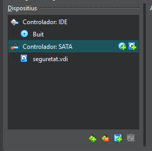
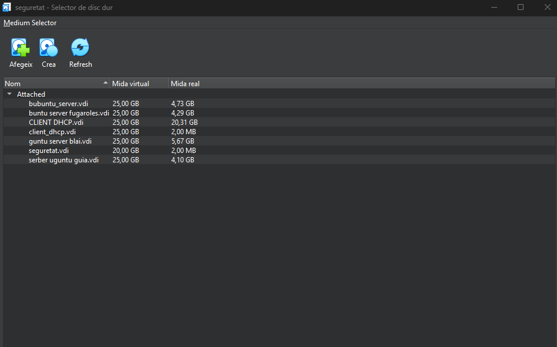

# recuperacio de la contrasenya 
## 1 configuracio de maquina virtual 
Haurem de afegir un dics a la maquina virtual 

A qui haruem de selecionar el disc que volem posrar

## 2 recuparacio de contrasenya
# iniciar la maquina virtual
Al inizar la maquina virtual haurem de fer shift + una lletre 
