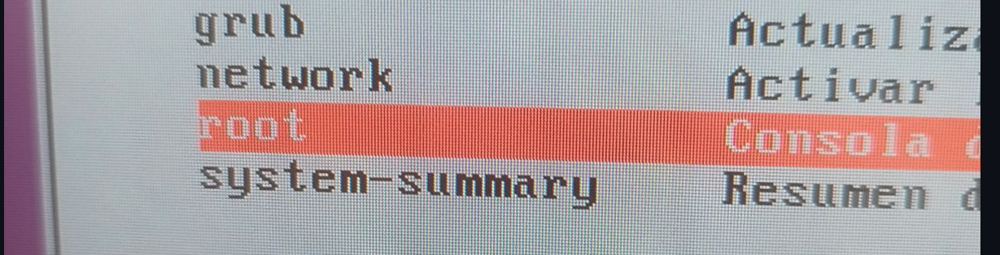

# recuperacio de la contrasenya 
## 1 configuracio de maquina virtual 
Haurem de afegir un dics a la maquina virtual 

A qui haruem de selecionar el disc que volem posrar

## 2 recuparacio de contrasenya
# iniciar la maquina virtual
Al inizar la maquina virtual haurem de fer shift + una lletre 

Haurem de selecionar la  opcio advance configuration from zorin

.png)

Seleciona la segona opcio 

## Despues de aixo en portara a una cunsola
selecionarem la opcio de root!

Despues de seleciona root haurem de escriure un text a la consola que es MOUNT -RW -O RUMOUT /
per despres escrure  PASSWD el usuari que voleu canviar la contrasenya 

Hara canviarem la contrasenya per un altre que tingui mes de 8 digits 

despues de renovar la contrasenya intentem inisar sesio amb lusuari
## rebestiment del grub
### investigacio de com rebesti el grub 
A qui deixo algunes guies de co fero, a part de que farem nosaltres 
# Recursos sobre cómo establecer una contraseña en GRUB

## [Puerto53](https://puerto53.com)
**Tutorial paso a paso** para establecer una contraseña en **GRUB** usando el comando `grub2-setpassword`.

---

## [José Web](https://jose-web.es)
**Guía** para poner una contraseña en **GRUB** y proteger el acceso al menú de arranque.

---

## [Computer New Age](https://computernewage.com)
**Explicación** sobre cómo habilitar la protección por contraseña en el cargador de arranque **GRUB**.

---

## [Máquinas Virtuales – Blog Virtualización](https://blogvirtualizacion.com)
**Instrucciones** para configurar una contraseña en **GRUB** utilizando `grub-md5-crypt`.

---

## [Salta Cybersecurity Club](https://saltacybersecurity.club)
**Análisis de seguridad** en **GRUB** y cómo protegerlo contra accesos no autorizados.

---

## [Red Hat Documentation](https://docs.redhat.com)
**Documentación oficial** de **Red Hat** sobre comandos de **GRUB** y cómo acceder a él en modo de usuario único.

### Pas 1 Quan  estem a dintre de zorin obrir una termilan, i escriurem  SUDO NANO /ETC/GRUB.a/40_CUSTOM

### Pas 2 modificar el arxiu 
